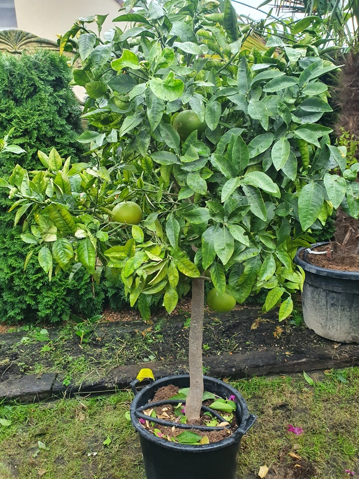

Pomeo
=========

Pomeo to inna nazwa dla owoców granatu, które są znane z intensywnego czerwonego koloru i charakterystycznego, kwaskowatego smaku.

Są bogate w przeciwutleniacze i często wykorzystywane w kuchni, zarówno do przygotowywania soków, jak i jako dodatek do dań mięsnych, sałatek czy deserów.

Owoce granatu, znane także jako pomeo, są symbolem obfitości, zdrowia i płodności w wielu kulturach na całym świecie.
